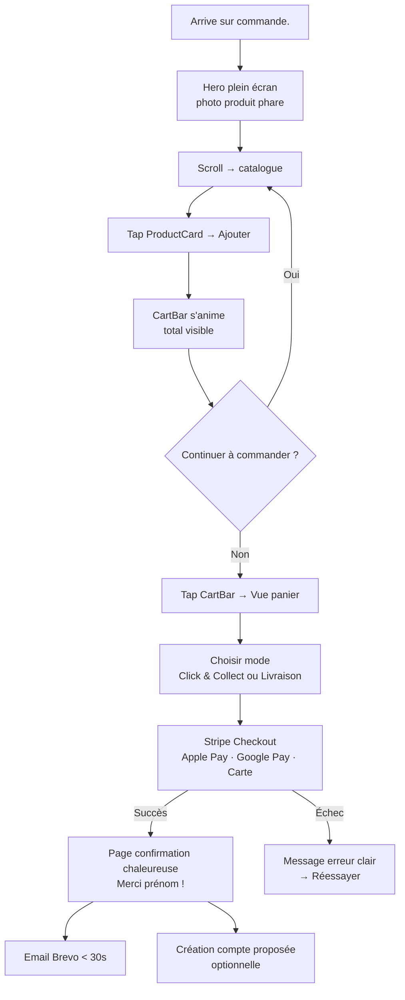
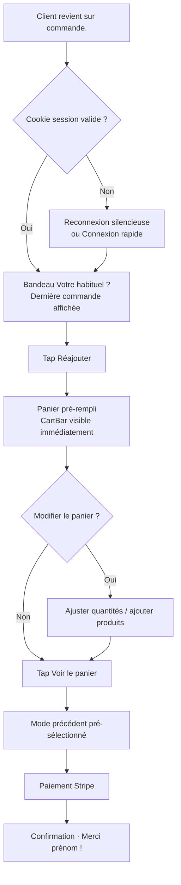
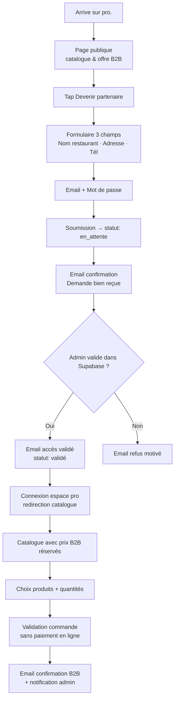
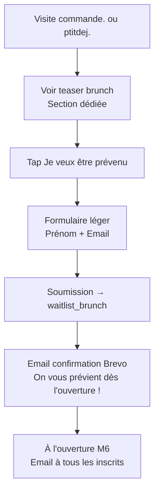

# UX Design Specification — Instant Dessert

**Auteur :** Sousousou
**Date :** 2026-05-20

---

<!-- UX design content will be appended sequentially through collaborative workflow steps -->

## Executive Summary

### Project Vision

Instant Dessert est un laboratoire artisanal qui doit convaincre en 3 secondes d'une qualité premium à travers 4 expériences web distinctes mais cohérentes : un portail de bifurcation, un espace pro B2B efficace, une dark kitchen immersive mobile-first, et une future plateforme brunch.

### Target Users

- **Restaurants (B2B)** : professionnels cherchant un fournisseur dessert fiable, prix négociés, commande en ligne sans téléphone.
- **Particuliers DK** : acheteurs impulsifs mobile, sensibles au visuel, cherchant un dessert de qualité en click & collect ou livraison rapide.
- **Brunch (M6)** : familles et groupes week-end, précommande planifiée.
- **Visiteur portail** : personne arrivant sans savoir si elle est pro ou particulier.

### Key Design Challenges

1. Bifurcation portail < 10s sans friction ni doute
2. Conversion mobile < 30s sur commande DK (achat impulsif)
3. Construire la crédibilité d'une marque nouvelle sans historique

### Design Opportunities

1. "Votre habituel ?" — fidélisation différenciante vs Uber Eats
2. Expérience DK immersive et émotionnelle vs concurrents utilitaires
3. Onboarding B2B digital en 2 min — avantage commercial concret

## Core User Experience

### Defining Experience

La commande DK est un achat impulsif mobile. L'expérience doit déclencher l'envie en 3 secondes et permettre de payer en moins de 2 minutes. Tout le reste en découle.

### Platform Strategy

- `commande.` + `ptitdej.` : mobile-first, touch, web
- `pro.` : desktop-compatible, clavier/souris
- `portail` : ultra-léger, toutes tailles d'écran
- Pas d'app native au lancement — PWA envisageable post-MVP

### Effortless Interactions

1. "Votre habituel ?" — 1 tap pour réajouter au panier
2. Panier persistant (localStorage) — survit à la fermeture du navigateur
3. Checkout DK en 3 étapes max (panier → livraison → paiement)
4. Onboarding B2B 2 min (3 champs, email de confirmation automatique)

### Critical Success Moments

- Photo produit → désir déclenché en < 3s (`commande.`)
- Confirmation de paiement claire et rassurante (`commande.`)
- Email "accès validé" → première commande partenaire (`pro.`)
- Portail → bon site en < 10s (`portail`)

### Experience Principles

1. **Désir avant tout** — chaque page de `commande.` vend avant d'informer
2. **Zéro friction sur le chemin critique** — du catalogue au paiement, aucun obstacle
3. **Confiance immédiate** — marque nouvelle = section labo + photos authentiques obligatoires
4. **Efficacité B2B** — le partenaire commande en 3 clics, pas en 10

## Desired Emotional Response

### Primary Emotional Goals

- `commande.` : Envie immédiate + Confiance (nouvelle marque)
- `pro.` : Efficacité + Fiabilité fournisseur
- `portail` : Clarté + Curiosité
- `ptitdej.` : Anticipation + Sentiment d'exclusivité (liste d'attente)

### Emotional Journey Mapping

Parcours prioritaire `commande.` :

Découverte → désir (< 3s) → catalogue → appétit stimulé → panier → confiance → paiement → sécurité ressentie → confirmation → anticipation → retour → fidélité émotionnelle ("mon habituel")

### Micro-Emotions

- Confiance vs Méfiance → photos authentiques + section labo
- Désir vs Indifférence → visuels "en coupe" plein écran
- Facilité vs Frustration → checkout 3 étapes, panier persistant
- Appartenance vs Isolation → prénom, "Votre habituel ?", fidélité
- Anticipation vs Anxiété → confirmation immédiate, statut visible

### Design Implications

- Chaque page produit DK : 1 grande photo émotionnelle avant le prix
- Section "Notre labo" obligatoire dès le lancement (crédibilité)
- Confirmation de paiement = page chaleureuse (pas juste un ticket)
- Emails transactionnels avec prénom et ton gourmand (pas robotique)

### Emotional Design Principles

1. L'image vend, le texte confirme — jamais l'inverse sur `commande.`
2. La transparence rassure — montrer le labo, les gens derrière la marque
3. Chaque interaction réussie doit être micro-célébrée (animation légère)
4. Le retour doit être plus doux que la première visite ("bon retour !")

## UX Pattern Analysis & Inspiration

### Inspiring Products Analysis

**Uber Eats** : référence pour la facilité de commande — panier bottom-sticky, catégories horizontales, checkout 3 étapes, cards produit minimalistes.

**Instagram** : référence pour le désir visuel — photos plein écran, scroll immersif, zéro chrome UI superflu, tap = révélation de détail.

**Deliveroo** : référence pour la clarté — hiérarchie visuelle nette (photo dominante + prix), filtres simples, bottom sheet panier sur mobile.

### Transferable UX Patterns

- Panier bottom-sticky mobile (Uber Eats) → `commande.` : total toujours visible
- Catégories scrollables horizontales → catalogue DK et pro, sans sous-menu
- "Ajouter" depuis la card sans ouvrir la fiche produit → conversion rapide
- Photo plein largeur par produit (Instagram) → une image cinématique par fiche
- Card minimaliste : photo 2/3 + nom + prix (Deliveroo)

### Anti-Patterns to Avoid

- Listes texte sans image → aucun désir déclenché
- Navigation 3+ niveaux → confusion et abandon
- Descriptions longues sur fiche produit → noient le visuel
- Compte obligatoire avant de commander → friction fatale
- Palette neutre sans identité → invisibilité parmi les concurrents

### Design Inspiration Strategy

**Adopter :** panier bottom-sticky, checkout 3 étapes, catégories horizontales scrollables

**Adapter :** cards style Deliveroo aux couleurs de la charte Instant Dessert (chocolat, crème, rose poudré)

**Éviter :** toute approche "liste menu restaurant", tout gris générique, toute friction avant le paiement

## Design System Foundation

### Design System Choice

**shadcn/ui + Tailwind CSS v4.3** — système thémeable dans `packages/ui`.

### Rationale for Selection

- Lancement urgent : composants accessibles prêts à personnaliser
- Charte graphique préservée via design tokens Tailwind (chocolat, crème, rose, caramel, blush)
- Composants copiés dans le projet (pas de dépendance externe figée)
- Accessibilité WCAG intégrée via Radix UI sous shadcn/ui
- Documentation excellente pour une équipe de 1-2 développeurs

### Implementation Approach

- **shadcn/ui fournit** : Button, Input, Badge, Modal (Dialog), Dropdown, Toast
- **Composants maison** dans `packages/ui` : Logo, ProductCard, ProductCardSkeleton, CookieBanner, CartBar
- Tokens de couleur Tailwind remplacent les defaults shadcn (zinc → chocolat, etc.)

### Customization Strategy

| Token shadcn/ui | Valeur Instant Dessert |
|---|---|
| `--background` | `#FFF7EE` (crème vanille) |
| `--foreground` | `#2B1A14` (chocolat profond) |
| `--primary` | `#D97773` (rose poudré) |
| `--accent` | `#C8953E` (caramel doré) |
| `--muted` | `#FCE7E3` (blush) |

## Defining Core Experience

### Defining Experience

"Voir → Vouloir → Commander" : l'utilisateur est séduit en 3s et commande en moins de 2 minutes sur mobile. L'expérience centrale est le tunnel catalogue → panier → paiement de `commande.instantdessert.fr`.

### User Mental Model

Référence connue : Uber Eats / Deliveroo. Attentes : cards photo + prix, ajout rapide, panier visible, checkout simple.

Twist Instant Dessert : 4 produits (zéro paralysie), marque forte, "Votre habituel ?" pour clients réguliers.

### Success Criteria

- Photo déclenche l'envie < 3s
- Ajout panier en 1 tap depuis la card
- Checkout < 2 minutes
- "Votre habituel ?" visible dès 2ème visite
- Confirmation (page + email) < 30s après paiement

### Novel UX Patterns

Patterns établis (Uber Eats) + twist propriétaire :
- "Votre habituel ?" → 1 tap pour réajouter la dernière commande
- CartBar bottom-sticky animée (pas un icône panier statique)
- Page de confirmation chaleureuse avec prénom (pas un ticket froid)

### Experience Mechanics

1. Hero plein écran → scroll vers catalogue
2. Card produit → tap "Ajouter" → CartBar s'anime
3. CartBar → bottom sheet récap panier
4. Choix livraison/retrait → Stripe checkout → confirmation chaleureuse

## Visual Design Foundation

### Color System

- Background : `#FFF7EE` (crème vanille, 60% de l'espace visuel)
- Foreground : `#2B1A14` (chocolat profond, texte principal)
- Primary : `#D97773` (rose poudré, boutons CTA, accents)
- Accent : `#C8953E` (caramel doré, étoiles, touches premium)
- Muted : `#FCE7E3` (blush, fonds cards, badges)
- Succès : `#4CAF50` | Erreur : `#E53935`
- Contraste WCAG : chocolat/crème = 12,4:1 AAA ✅
- Rose poudré : usage CTA/décoration uniquement (pas texte courant)

### Typography System

- **Display / H1 / H2** : Cormorant Garamond — émotion, identité, désir
- **H3 / Body / Small / Caption** : Montserrat — information, prix, action
- Taille body minimum : 16px (accessibilité mobile)
- Règle d'or : Cormorant = désir, Montserrat = clarté

| Niveau | Taille mobile | Taille desktop |
|---|---|---|
| Display | 40px | 64px |
| H1 | 32px | 48px |
| H2 | 24px | 36px |
| H3 | 18px | 22px |
| Body | 16px | 16px |
| Small | 14px | 14px |
| Caption | 12px | 12px |

### Spacing & Layout Foundation

- Base unit : 4px (Tailwind natif)
- Container max-width : 1280px, padding 16px mobile / 32px desktop
- Grille catalogue DK : 1 col mobile → 2 col tablet → 3 col desktop
- Grille dashboard pro : 1 → 2 → 4 colonnes

### Accessibility Considerations

- Tous les textes principaux : ratio > 7:1 (AAA WCAG)
- Touch targets minimum : 44×44px (WCAG 2.5.5)
- Font size minimum : 16px body, 14px labels
- Rose poudré sur blanc uniquement pour grands textes/boutons (ratio 3,2:1)

## Design Direction Decision

### Design Directions Explored

Trois directions explorées sur la page catalogue de `commande.instantdessert.fr` :
1. **Lumineux Crème** — fond crème, cards blanches aérées, grille 2 colonnes
2. **Immersive Dark** — fond chocolat profond, liste verticale, visuels lumineux
3. **Bold Éditorial** — typographie forte, style magazine noir & crème

Fichier interactif : `_bmad-output/planning-artifacts/ux-design-directions.html`

### Chosen Direction

**Direction 1 (Lumineux Crème) + CartBar Direction 2 (rose/blanc)**

- Fond pages : crème vanille `#FFF7EE`
- Cards produit : blanches, `rounded-2xl`, `shadow-sm`
- Grille catalogue : 2 colonnes mobile → 3 colonnes desktop
- CartBar : fond rose poudré `#D97773` + texte blanc + bouton blanc `color: rose`
- Header : sticky, fond crème, `border-b` blush

### Design Rationale

Direction 1 rassure et met en valeur les produits sur fond clair — cohérent avec une marque artisanale nouvelle qui doit inspirer confiance. Le CartBar rose est le seul élément plein rose de la page : hiérarchie CTA maximale, œil guidé naturellement vers l'action de commande.

### Implementation Approach

- `packages/ui/CartBar.tsx` : `bg-rose`, texte blanc, bouton `bg-white text-rose`
- `packages/ui/ProductCard.tsx` : `bg-white rounded-2xl shadow-sm`
- Bouton "+" sur card : `bg-rose text-white rounded-full`
- Layout catalogue : `grid grid-cols-2 md:grid-cols-3 gap-3`
- Header : `sticky top-0 bg-creme border-b border-blush`

## User Journey Flows

### Journey 1 — Commande DK première fois (parcours critique)



### Journey 2 — Commande DK récurrente ("Votre habituel ?")



### Journey 3 — Inscription & première commande partenaire B2B



### Journey 4 — Liste d'attente brunch



### Journey Patterns

| Pattern | Application |
|---|---|
| CartBar sticky rose | Toujours visible sur commande. — CTA constant |
| Email immédiat Brevo | Après toute action : commande, inscription, waitlist |
| Mode précédent mémorisé | Click & Collect ou Livraison pré-sélectionné au retour |
| Erreur → Réessayer | Paiement échoué = message clair + chemin de retour |
| Confirmation chaleureuse | Page + email avec prénom, jamais un ticket froid |

### Flow Optimization Principles

1. Zéro compte obligatoire avant la première commande DK
2. Chaque retour client doit être plus rapide que la visite précédente
3. Les erreurs ne bloquent jamais — toujours un chemin de retour clair
4. Le mode de livraison mémorisé réduit les frictions au retour

## Component Strategy

### Design System Components (shadcn/ui)

| Composant | Usage |
|---|---|
| `Button` | Tous les CTA (Commander, Ajouter, Valider) |
| `Input` | Formulaires inscription, connexion, checkout |
| `Badge` | Statut commande, catégorie produit |
| `Dialog` | Modales panier mobile, confirmation suppression |
| `Toast` | Feedback ajout panier, erreurs paiement |
| `Tabs` | Catégories catalogue, navigation dashboard pro |
| `Select` | Sélection quantité, mode livraison |
| `Label` | Formulaires accessibles |

### Custom Components

**CartBar** — sticky bottom, toutes les pages `commande.`
- États : vide (masqué) | 1+ article (visible) | animation ajout
- Style : `bg-rose text-white rounded-t-2xl sticky bottom-0 z-50`
- Bouton : `bg-white text-rose rounded-full font-bold`
- `aria-label="Panier, X articles, Y €"`

**ProductCard + ProductCardSkeleton**
- États : default | hover (`shadow-md`) | adding (bounce) | out-of-stock (`opacity-50`)
- Style : `bg-white rounded-2xl shadow-sm overflow-hidden`
- Bouton "+" : `bg-rose text-white rounded-full w-8 h-8`
- `aria-label="Ajouter X au panier"`

**HabitualBanner** — clients connectés avec historique
- Style : `bg-blush rounded-xl p-3 mx-4`
- Action : tap "Réajouter" → panier pré-rempli + CartBar animée
- `role="region" aria-label="Commande habituelle"`

**ModeSelector** — choix Click & Collect / Livraison
- 2 cards côte à côte : `border-2 border-rose` si sélectionné
- `radiogroup` avec `aria-checked`

**OrderConfirmation** — post-paiement
- Confetti léger + "Merci prénom !" + récap + heure estimée
- Focus automatique sur `h1` à l'arrivée

**Logo** — partagé 4 apps
- Variantes : default | monochrome-clair | monochrome-sombre
- Tailles : sm (24px) | md (32px) | lg (48px)

### Component Implementation Strategy

Tous les composants maison sont construits avec les tokens Tailwind de la charte — jamais de couleurs hardcodées. Ils s'appuient sur shadcn/ui pour les comportements d'accessibilité de base (focus trap, aria, keyboard nav).

### Implementation Roadmap

**Phase 1 — MVP DK (S1-S2)** : Logo, ProductCard, ProductCardSkeleton, CartBar, HabitualBanner

**Phase 2 — Checkout & Auth (S2-S3)** : ModeSelector, OrderConfirmation, CookieBanner

**Phase 3 — B2B & Brunch (S3-S4)** : B2BOrderForm, WaitlistForm

## UX Consistency Patterns

### Button Hierarchy

| Niveau | Classes Tailwind | Usage |
|---|---|---|
| Primaire | `bg-rose text-white rounded-full px-5 py-2.5 font-semibold` | Commander, Payer, Ajouter, Valider |
| Secondaire | `border border-chocolat text-chocolat rounded-full px-5 py-2.5` | Retour, Annuler, Voir catalogue |
| Ghost | `text-rose underline text-sm` | Liens secondaires, "En savoir plus" |
| Destructif | `bg-red-600 text-white rounded-full px-5 py-2.5` | Supprimer compte, Vider panier |

Règle : **un seul bouton primaire par écran** — jamais deux éléments rose plein côte à côte.

### Feedback Patterns

- **Ajout panier** : bounce animation ProductCard + CartBar s'anime + Toast 1,5s
- **Paiement réussi** : page `OrderConfirmation` dédiée + email Brevo (pas de toast)
- **Erreur paiement** : message inline rouge sous le formulaire Stripe
- **Formulaire invalide** : `border-red-500` sur champ + `<p role="alert">` sous le champ
- **Chargement** : Skeleton (`animate-pulse`) aux mêmes dimensions que le contenu
- **Action en cours** : bouton `disabled opacity-60 cursor-not-allowed` + spinner inline

### Form Patterns

- Label toujours au-dessus du champ (jamais placeholder seul)
- Validation `onBlur` — pas uniquement à la soumission
- Message d'erreur inline sous chaque champ invalide (`role="alert"`)
- Bouton de soumission désactivé pendant l'envoi (anti double-clic)
- Mention "Champs obligatoires *" en haut de chaque formulaire

### Navigation Patterns

- `commande.` : header sticky crème + CartBar sticky bas
- `pro.` : sidebar desktop + bottom nav mobile (dashboard)
- `portail` : aucune nav — 2 boutons bifurcation seulement
- `ptitdej.` : header simple, pas de nav complexe

### Additional Patterns

**États vides :** message descriptif + action proposée (ex: "Votre panier est vide" → "Voir notre catalogue")

**Mobile-first :**
- Bottom sheet au lieu de modale centrée sur mobile
- Touch targets minimum 44×44px partout
- Swipe to dismiss sur toasts et bottom sheets
- Aucun hover comme seul indicateur d'état — toujours un fallback tap

## Responsive Design & Accessibility

### Responsive Strategy

| Site | Priorité | Comportement |
|---|---|---|
| `commande.` | Mobile-first critique | 1 col → 2 col → 3 col ; CartBar bottom-sticky |
| `pro.` | Desktop-compatible | Sidebar desktop, bottom nav mobile |
| `portail` | Toutes tailles | Ultra-léger, 2 boutons centrés |
| `ptitdej.` | Mobile-first | Page unique, scroll vertical |

### Breakpoint Strategy

Breakpoints Tailwind natifs — approche mobile-first stricte :

```
base  → < 640px    mobile portrait  (priorité 1)
sm:   → 640px+     mobile paysage / petite tablette
md:   → 768px+     tablette
lg:   → 1024px+    desktop
xl:   → 1280px+    large desktop (container max-width)
```

Classes Tailwind `base` = mobile. `md:` et `lg:` = enrichissements progressifs.

### Accessibility Strategy

Niveau cible : **WCAG 2.1 AA** (standard e-commerce, RGAA France).

| Critère | Solution |
|---|---|
| Contraste texte | Chocolat/crème = 12,4:1 ✅ AAA |
| Contraste CTA | Rose/blanc sur boutons = 3,2:1 ✅ AA grands textes |
| Touch targets | Minimum 44×44px (WCAG 2.5.5) |
| Navigation clavier | `Tab` logique + `focus-visible:ring-2 ring-rose` |
| Screen readers | HTML sémantique (`nav`, `main`, `section`, `h1-h3`) + `aria-label` |
| Feedback dynamique | `role="alert"` erreurs, `aria-live="polite"` CartBar |
| Animations | `@media (prefers-reduced-motion: reduce)` — animations désactivées |
| Images | `alt` descriptif obligatoire sur toutes les images produit |

### Testing Strategy

| Outil | Usage | Coût |
|---|---|---|
| axe DevTools (Chrome) | Audit accessibilité automatique | Gratuit |
| Lighthouse (CI Vercel) | Score perf + a11y sur chaque PR | Gratuit |
| iPhone Safari (réel) | Test principal mobile B2C | — |
| Android Chrome (réel) | Couverture Android | — |
| Navigation clavier manuelle | Test `Tab` sur flows critiques | — |

Seuil : **Lighthouse Accessibility ≥ 90** avant merge sur `main`.

### Implementation Guidelines

- Classes Tailwind mobile-first (jamais desktop-first)
- `rem` pour toutes les tailles de texte (jamais `px`)
- `next/image` obligatoire pour toutes les images produit
- `focus-visible:ring-2 ring-rose ring-offset-2` sur tous les éléments interactifs
- `prefers-reduced-motion` : désactiver bounce CartBar et confetti OrderConfirmation
